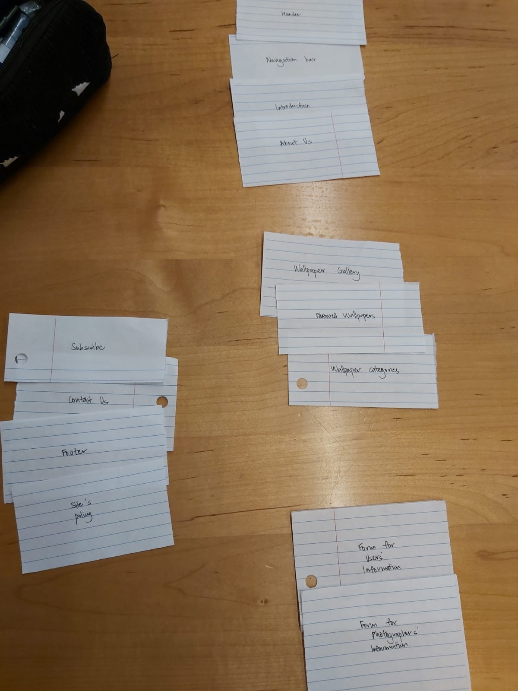
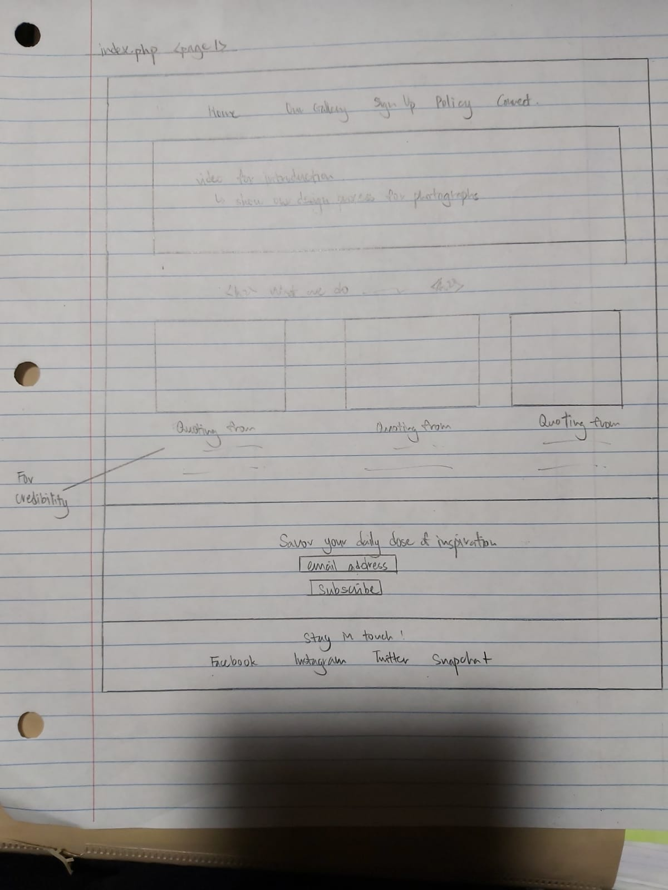
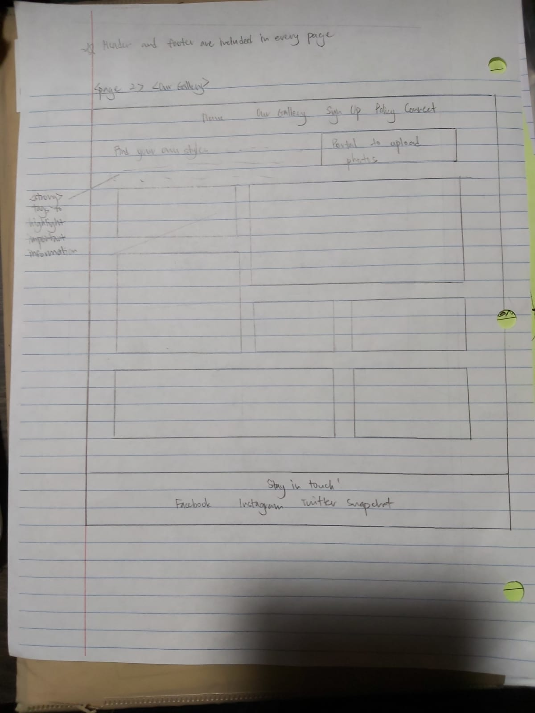
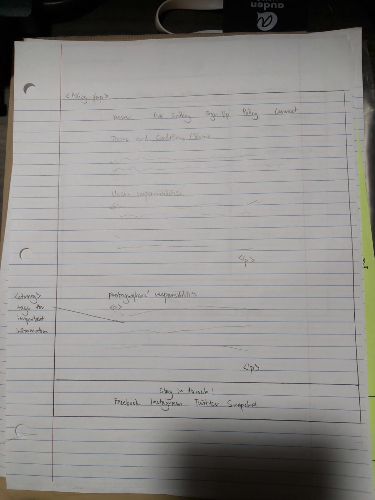

# Project 1: Design Journey

Be clear and concise in your writing. Bullets points are encouraged.

**Everything, includin, must be visible in Markdown Preview.** If it's not visible in Markdown Preview, then we won't grade it. We won't give you partial credit either. This is your warning.

## Existing Design, Planning, & Refined Design (Milestone 1)

### Existing Site: Target Audience I (Milestone 1)
> Who is your _existing_ site's target audience?
People looking for phone wallpapers

### Existing Site: Target Audience I Needs (Milestone 1)
> Document your existing site's target audience's needs.
> List each need below. There is no specific number of needs required for this, but you need enough to do the job.

- Need #1: [Brief Title]
  - **Need**
    - > What does your existing target audience need?
     for phone/desktop wallpaper
    - Ease/ convenience of looking for wallpapers for a regular refreshing change
  - **Design Choices**
    - > How does your existing site meet this need?
    - Has a section for a gallery of wallpaper
    - Feature wallpapers favored by other users
- Need #2: ...
  - ... etc.
- Need #3: ...
  - ...
- etc.


### Existing Site: Design/Sketches (Milestone 1)
> Sketch your existing site. Include these sketches here.
> DO NOT COPY SKETCHES FROM THE ORIGINAL ASSIGNMENT! Create new sketches here. This is part of the design process to get you thinking about the strengths/weaknesses of the current design.
> Provide a brief explanation _underneath_ each sketch.


### Refined Site: Target Audience II (Milestone 1)
> Who is your additional/secondary target audience?
freelance/professional photographers/artists

### Refined Site: Target Audience II Needs (Milestone 1)
> Document target audience II's needs.
> List each need below. There is no specific number of needs required for this, but you need enough to do the job.

- Need #1: [Brief Title]
  - **Need**
    - > What does your target audience II need?
    - portal for uploading their artworks/photographs
    - information about the reward they will get from their work
  - **Design Ideas and Choices**
    - > How will you refine your site's design to meet this need?
    - I will include a form submission or links for them to upload their work
    - dedicate a section for the rewards or rather information about any potential copyright issues/ commercial purposes
- Need #2: ...
  - ... etc.
- Need #3: ...
  - ...
- etc.


### Refined Site: Content Organization/Navigation (Milestone 1)
> Identify the content that is necessary for both target audiences.
> List the content here.
> Don't forget to include the form.

- (Example) Cornell Admissions Process
- (Example) Cornell Admission Stats
- ...Form for submitting users' information
- ...Form for submitting the photographers/artists' information
- ...Site's policy about copyright issues


> Organize the content for the target audience and identify possible pages for the content using card sorting.
> First, organize the content for target audience I. Document your card sorting by taking a photo and including it here.


> Second, organize the content for target audience II. Document your card sorting by taking a photo and including it here.


> Next, organize the content for both target audiences. Document your card sorting by taking a photo and including it here.




> Lastly, list the pages that resulted from your final card sort (i.e. your site's navigation).

- (Example) Home
- (Example) Admissions
- About Us/Introduction
- Wallpapers gallery
- Form for photographers' and users' information
- Site's policy for submission and download of photos
- Contact Us


### Refined Site: Design (Milestone 1)
> Refine the design of your site to meet the needs of _both_ target audiences.
> Include sketches of each page of the refined design.
> Provide a brief explanation _underneath_ each sketch.
> Document your _entire_ design process. **Show your preliminary sketches and your final sketches.**
> Don't forget the form and confirmation page!








### Partial Plan (Milestone 1)
> Using your refined sketches, plan your site's partials.
> You may describe each partial or sketch it. It's up to you!
- Site's partials include header and footer
- Header contains navbar and links to each page
 - navbar will also show which page you are currently on
- Footer will contain general contact information of the site to connect with users
 - it will contain the logos/names of the each social media platform and links to those sites

---

## Sticky Form Planning (Milestone 2)

### Sticky Form (Milestone 2)
> What controls do you need for your form?
The form will be filtering input that contains html special characters so the users won''t be able to key in bad input.

> Plan out your feedback messages for your form. You may sketch (probably the easiest) or write it out.
The feedback messages will be notifying the users whichever form that's not filled by saying (form name) is required'.


> How does this form meet the needs of at least one of your target audiences (specify which)?
This form meets the needs of both target audience to create an account in the system.


### Validation Code Plan (Milestone 2)
> Write out your pseudocode plan for handling the validation of the form.

```
read the input from post, filter accordingly, save the input in variables and then output values with html special characters removed.
```

---

## Complete & Polished Website (Final Submission)

### Target Audiences (Final Submission)
> Tell us how your final site meets the needs of the target audiences. Be specific here. Tell us how you tailored your design, content, etc. to make your website usable by both target audiences.
In the final site, the contents are arranged according to the results of card sorting and meant to put both target audience's needs into the same pages and so the general information is placed on the home page. Both target audience, users and photographers will be able to read the information about the website and decide if they like the site. If they do, they will then navigate to the sign up/Policy/ Gallery page for further information. The gallery page is meant to satisfy the needs of the target audience, users to look for phone wallpapers. The policy page is meant for both target audience, and users' portion is above photographers' as users are expected to constitute a larger percentage among the target audience. Also, the sign up page is for both target audience to create their accounts.


### Additional Design Justifications (Final Submission)
> If you feel like you haven’t fully explained your design choices in the final submission, or you want to explain some functions in your site (e.g., if you feel like you make a special design choice which might not meet the final requirement), you can use the additional design justifications to justify your design choices. Remember, this is place for you to justify your design choices which you haven’t covered in the design journey. You don’t need to fill out this section if you think all design choices have been well explained in the design journey.
Labels for each form is removed to reduce clutter on the sign up page. Names of forms are placed in the form instead. Also, the upload portal could not be implemented at this point as it belongs to later part of the course.


### Self-Reflection (Final Submission)
> Reflect on what you learned during this assignment. How have you improved from 1300? What things did you have trouble with?
I have learned to filter and validate input (server-side validation), make the forms sticky, and prevent any potential dangerous input from users for phishing. I had trouble with programmatically show the user the current page they are on, as the styling for that is overwritten elsewhere in main.css. It took some time to debug and I had to opt for !important in the end.
