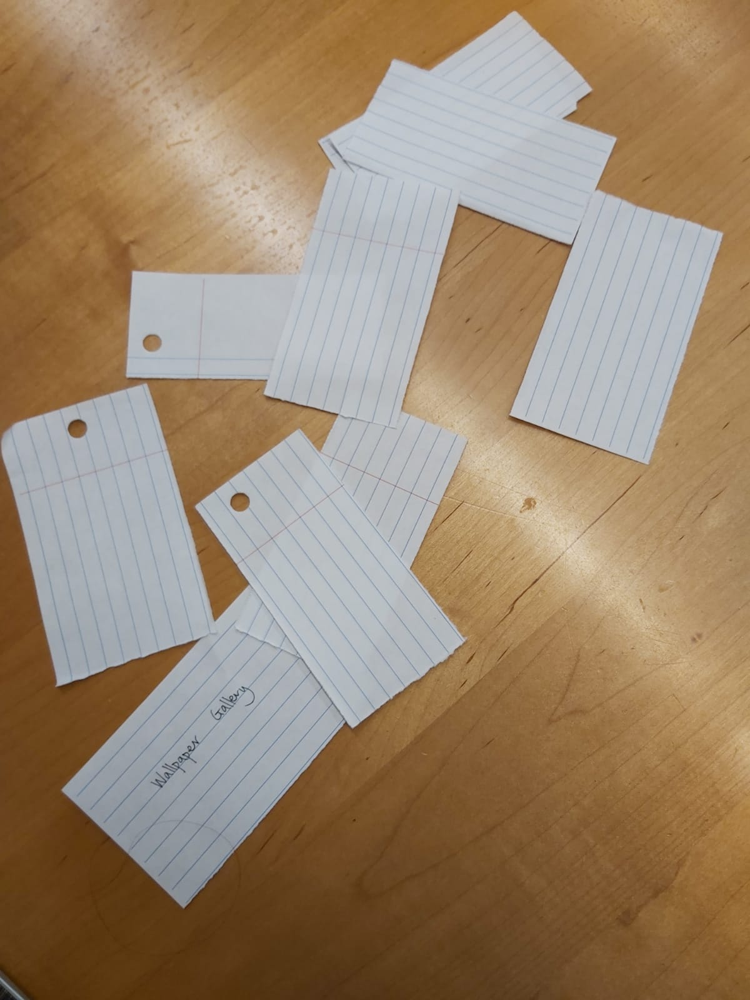
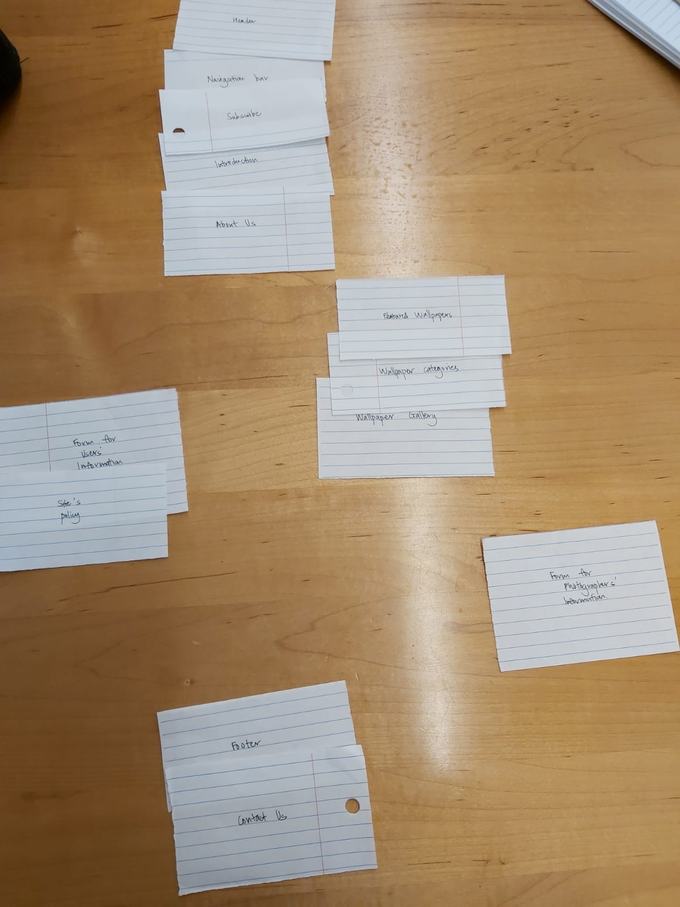
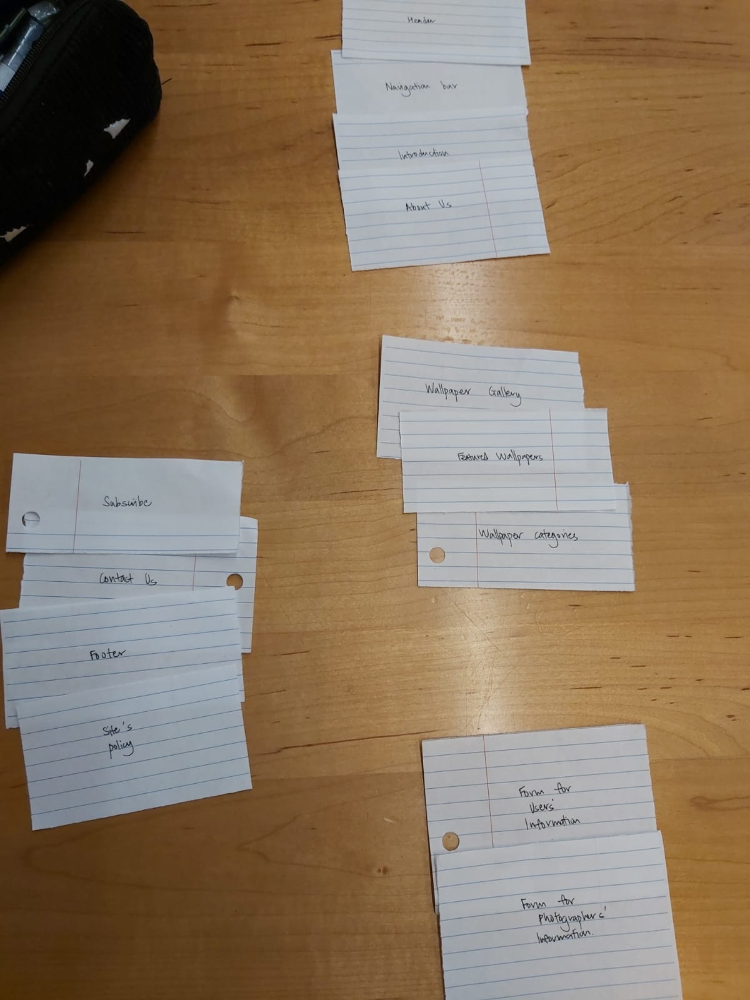
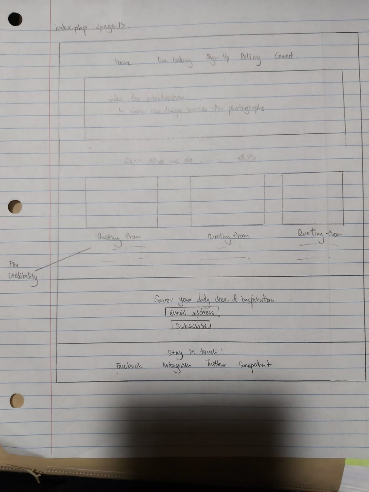
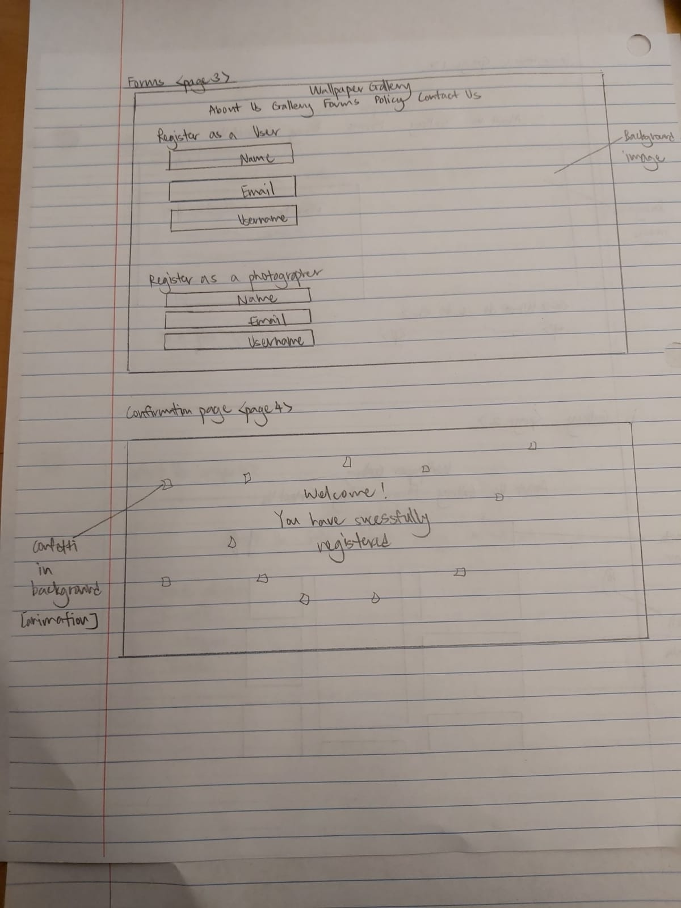
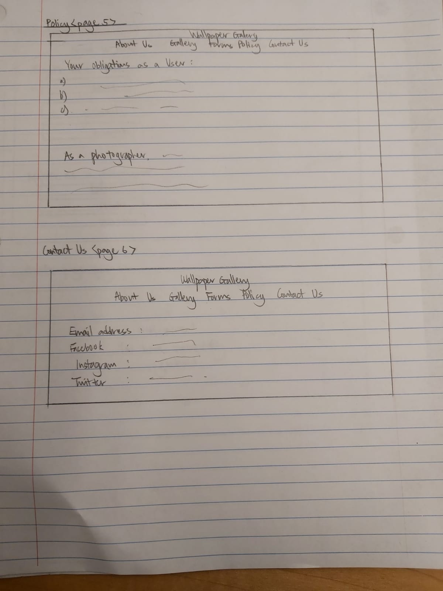
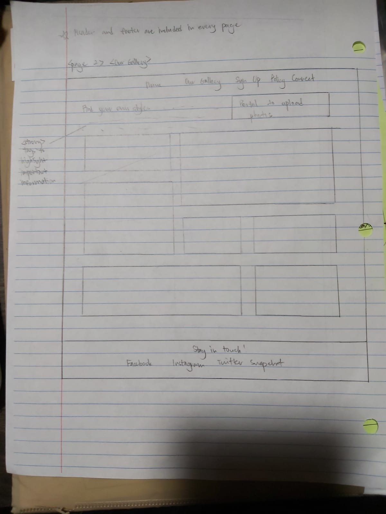
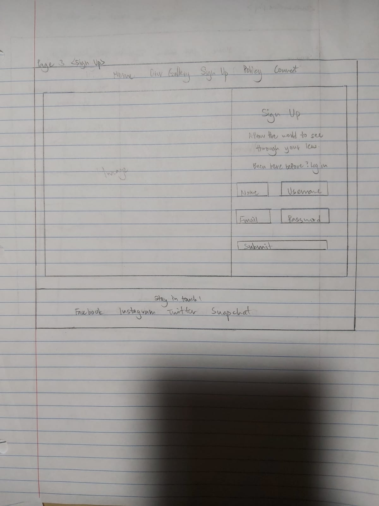
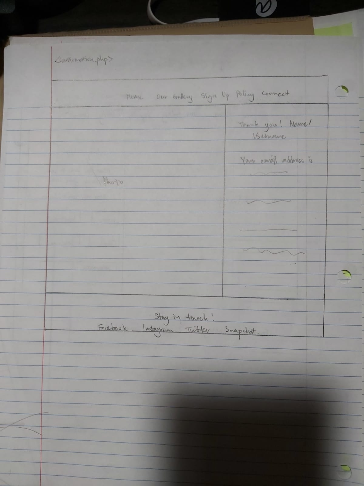
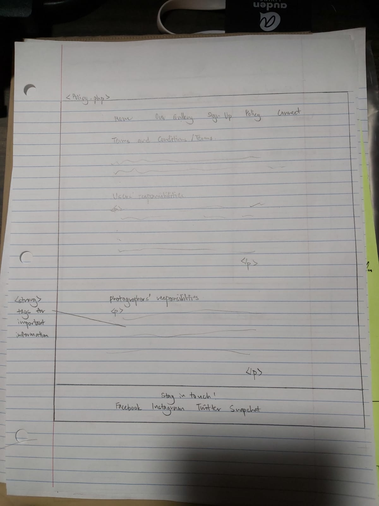

### Target Audience

> Who is your additional/secondary target audience?
> freelance/professional photographers/artists who wish to share/ browse device wallpapers

### Target Audience Needs

- Need #1: [Brief Title]
  - **Need**
    - > What does your target audience II need?
    - portal for uploading their artworks/photographs
    - information about the reward they will get from their work
  - **Design Ideas and Choices**
    - > How will you refine your site's design to meet this need?
    - I will include a form submission or links for them to upload their work
    - dedicate a section for the rewards or rather information about any potential copyright issues/ commercial purposes

### Content Organization/Navigation

- ...Form for submitting users' information
- ...Form for submitting the photographers/artists' information
- ...Site's policy about copyright issues

> Card sorting
> 
> 
> 

> Pages resulted from card sorting

- Wallpapers gallery
- Form for photographers' and users' information
- Site's policy for submission and download of photos
- Contact Us

> Design
> 
> 
> 
> 
> 
> 
> 
> 
